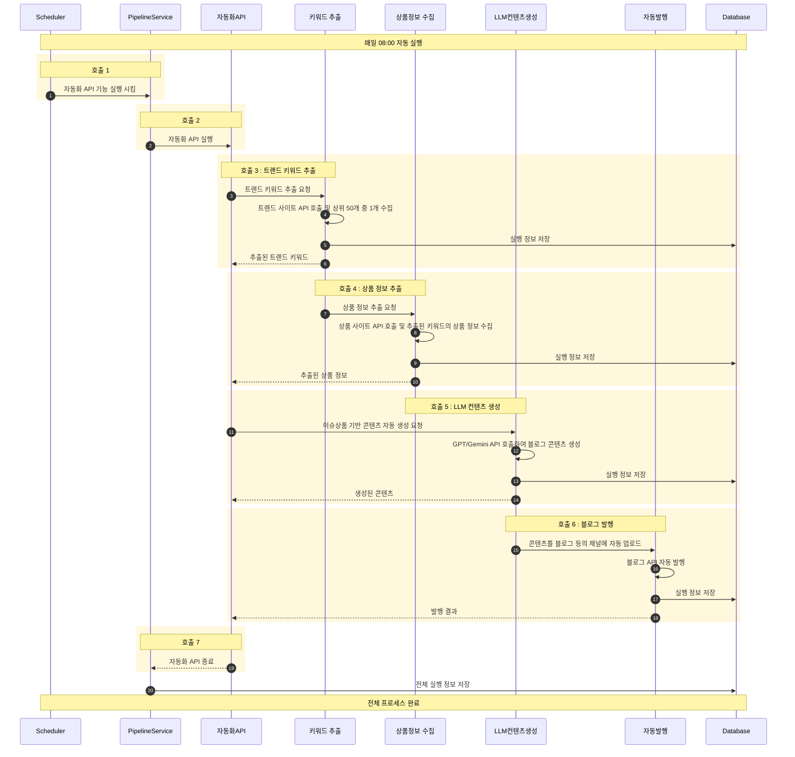

호출 1: Scheduler가 정해진 시간에 PipelineService 실행  
호출 2: PipelineService가 자동화 API 실행 시작  
호출 3: 트렌드 사이트에서 키워드 추출 + DB 저장  
호출 4: 상품 사이트에서 상품 정보 추출 + DB 저장
호출 5: LLM으로 상품 정보 기반 콘텐츠 생성 + DB 저장  
호출 6: 블로그에 콘텐츠 자동 발행 + DB 저장  
호출 7: 자동화 API 실행 종료 및 전체 실행 정보 저장  

### mermaid code

