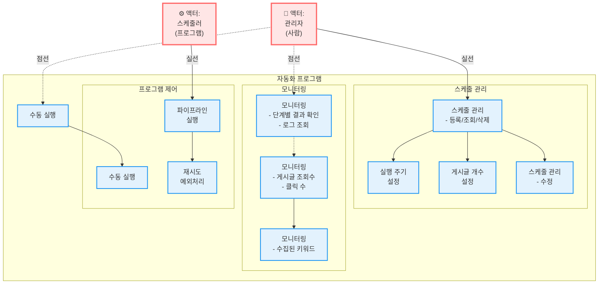

---

## 관계 설명

### **액터 → 유스케이스 관계**

| 액터 | 유스케이스 | 관계 유형 | 설명 |
|------|-----------|----------|------|
| 관리자 | 스케줄 관리 | **실선** | 직접 스케줄을 등록/조회/삭제/수정 |
| 관리자 | 수동 실행 | **점선** | 필요 시 수동으로 파이프라인 실행 |
| 관리자 | 모니터링 | **점선** | 실행 결과 및 로그 확인 |
| 스케줄러 | 파이프라인 실행 | **실선** | 자동으로 파이프라인 실행 |

---

### **유스케이스 간 관계**

| 유스케이스 A | 유스케이스 B | 관계 | 설명 |
|-------------|-------------|------|------|
| 스케줄 관리 | 실행 주기 설정 | **포함** | 스케줄 설정 시 주기 설정 필요 |
| 스케줄 관리 | 게시글 개수 설정 | **포함** | 스케줄 설정 시 개수 설정 필요 |
| 스케줄 관리 | 스케줄 수정 | **연관** | 수정 기능 포함 |
| 수동 실행 | 프로그램 제어의 수동 실행 | **연결** | 실제 실행은 프로그램 제어에서 |
| 단계별 결과 확인 | 게시글 조회수 | **점선** | 연관 정보 |
| 게시글 조회수 | 수집된 키워드 | **연결** | 세부 정보 확인 |
| 파이프라인 실행 | 재시도/예외처리 | **포함** | 실행 시 에러 처리 포함 |

---

## 💡 핵심 설계 특징

### 1. **2개 액터 구분**

```
👤 관리자 (사람)
  └─ 시스템 관리 및 모니터링 담당
  
⚙️ 스케줄러 (프로그램)
  └─ 자동 실행 담당
```

### 2. **4개 기능 그룹**


1. 스케줄 관리 (CRUD + 설정)
2. 수동 실행 (즉시 실행)
3. 모니터링 (결과 확인)
4. 프로그램 제어 (내부 로직)


### 4. **관계 유형**

- **실선 (->)**: 주요 기능, 직접 사용
- **점선 (-.-.>)**: 선택적 기능, 간접 사용
- **화살표**: 연관 관계

---


## 📊 유스케이스 실행 시나리오

### **시나리오 1: 스케줄 등록 및 자동 실행**

1. 관리자가 **스케줄 관리**에서 새 스케줄 등록
2. **실행 주기 설정** (예: 매일 08:00)
3. **게시글 개수 설정** (예: 일일 20건)
4. 스케줄러가 08:00에 **파이프라인 실행**
5. 관리자가 **모니터링**으로 결과 확인

---

### **시나리오 2: 수동 실행 및 모니터링**

1. 관리자가 **수동 실행** 클릭
2. 프로그램 제어의 **수동 실행** 처리
3. **파이프라인 실행**
4. 실패 시 **재시도/예외처리** 자동 작동
5. 관리자가 **단계별 결과 확인**
6. **게시글 조회수** 및 **수집된 키워드** 모니터링

---
