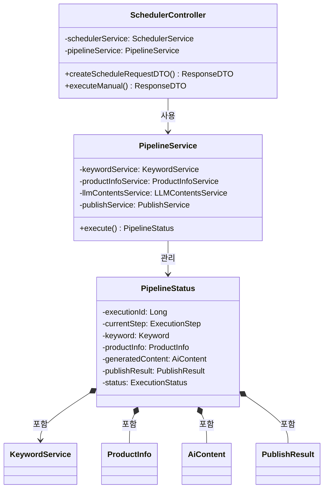

---

## 💡 **핵심 설계 패턴**

### **1. 레이어드 아키텍처**
```
Controller → Service → Mapper → DB
(단방향 의존성, 결합도 최소화)
```

---

### **2. 오케스트레이션 패턴**
```
PipelineService (지휘자)
  ├─→ KeywordService
  ├─→ ProductInfoService
  ├─→ LLMContentsService
  └─→ PublishService
```

---

### **3. DTO/VO 분리**
```
UI ↔ Java: RequestDTO / ResponseDTO
Java ↔ DB: TrendKeywordRequestVO 등
Java ↔ Java: PipelineStatus
```